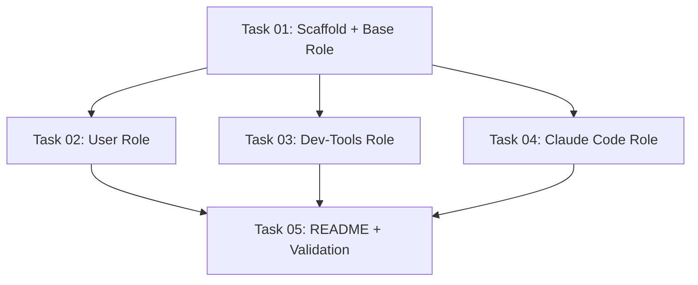

# Plan: Ansible Playbook for Claude Code Development VM

## Original Work Order

> I need to create an Ansible playbook to recreate this virtual machine for off-the-leash Claude Code usage. Inspect (but DO NOT CHANGE) the system to understand what is important to recreate it. The VM should contain:
>
> - The hostname should be different - claude.lan instead of replica.lan
> - A user called "claude" - note this VM started using the root user, but we want to consolidate on the claude user.
> - ssh public keys to ssh in fetched from https://github.com/deviantintegral.keys
> - nodejs / npm
> - docker + ddev
> - tmux
> - the current tmux configuration file for the claude user.
> - passwordless sudo access for the claude user
>
> There may be other aspects I've missed. Investigate the machine and ask questions. You can use sudo to look at the contents of the /root directory.

## Plan Clarifications

| Question | Answer |
|----------|--------|
| Include Home Assistant? | No, exclude HA and its pip dependencies |
| Include cloudflared? | Yes, install the package |
| Extra packages scope? | java, bats, vim, htop, ncdu, curl, wget, rsync, unzip, git, golang, python3, uv |
| Claude Code + bashrc? | Yes, install Claude Code and configure bashrc (IS_SANDBOX, alias, EDITOR) |
| SSH agent forwarding? | Yes, set up ~/.ssh/rc and tmux SSH_AUTH_SOCK symlink |
| Git config approach? | Variables with defaults: name="Andrew Berry", email="andrew@furrypaws.ca", plus `includeIf` for ~/lullabot/ -> andrew.berry@lullabot.com |
| Target OS? | Debian 13 (trixie) only |
| Locale? | Configurable variable, default en_CA.UTF-8 |
| mkcert? | Install from Debian apt packages and run `mkcert -install` to generate local CA |
| Git includeIf? | Yes, use `includeIf` for directory-based email |
| Bootstrap SSH access? | Fresh VM accessible as root via SSH key. Playbook connects as root, creates claude user. |
| Cloudflared install method? | Add Cloudflare's official APT repository |
| Docker registry proxy? | Yes, configure `docker-registry-proxy.lan:3128` — install CA cert, set Docker HTTP/HTTPS proxy via systemd drop-in. Proxy is always available (no connectivity check needed). |

## Executive Summary

This plan creates an Ansible playbook that provisions a fresh Debian 13 (trixie) VM into a fully-configured Claude Code development environment. The playbook connects to the target VM as root via SSH key, then consolidates all configuration into a single `claude` user with passwordless sudo, SSH key access, and a complete development toolchain.

The approach uses Ansible roles to organize configuration into logical, reusable components. The playbook handles everything from hostname configuration through development tool installation to user environment setup. Key tools include Docker CE (from Docker's official repo), ddev (from its official repo), Node.js/npm (Debian packages), Go, Python 3 with uv, Claude Code (standalone binary installer), and various CLI utilities.

Ansible provides idempotent, declarative configuration that can be version-controlled and re-run safely. The playbook will be validated with static analysis tools (`ansible-lint`, `--syntax-check`) during development; manual VM testing will be done by the user after implementation.

## Context

### Current State vs Target State

| Current State | Target State | Why? |
|---------------|-------------|------|
| Hostname: replica.lan | Hostname: claude.lan | Distinct identity for the new VM |
| Config split between root and claude users | Everything under claude user only | Consolidate to single-user workflow |
| SSH keys manually placed | SSH keys fetched from GitHub (deviantintegral) | Automated, always up-to-date keys |
| Packages installed ad-hoc over time | All packages declared in Ansible playbook | Reproducible, documented setup |
| Docker repo manually configured | Docker APT repo added by playbook | Repeatable installation |
| ddev repo manually configured | ddev APT repo added by playbook | Repeatable installation |
| cloudflared installed from .deb file | cloudflared from Cloudflare APT repo | Managed updates via apt |
| Claude Code installed manually | Claude Code installed via official installer script | Automated provisioning |
| Git config set manually | Git config with includeIf for directory-based email | Automatic email switching per project directory |
| tmux.conf created manually | tmux.conf deployed as template | Consistent configuration |
| SSH agent forwarding configured manually | SSH rc script deployed by playbook | Persistent agent forwarding through tmux |
| No Docker registry proxy configured | Docker registry proxy at `docker-registry-proxy.lan:3128` with CA trust and systemd proxy config | Faster Docker image pulls via local caching proxy |
| No configuration management | Ansible playbook in version control | Reproducible, auditable infrastructure |

### Background

The current VM (replica.lan) was built up incrementally — packages were installed as needed, configurations were tweaked by hand, and setup knowledge lives only in the machine's current state. This playbook captures that state as code so the environment can be reliably recreated.

Key observations from the system investigation:
- **OS**: Debian 13 (trixie), 4 CPUs, 8GB RAM
- **Docker**: Installed from Docker's official APT repository (docker-ce, docker-ce-cli, containerd.io, docker-buildx-plugin, docker-compose-plugin)
- **ddev**: v1.25.1, installed from ddev's official APT repository (`deb [signed-by=/etc/apt/keyrings/ddev.gpg] https://pkg.ddev.com/apt/ * *`)
- **Node.js**: v20.x from Debian's native packages (nodejs + npm)
- **Python**: 3.13.x from Debian packages, uv installed as standalone binary
- **Go**: Not currently installed; available as `golang` 1.24 from Debian repos
- **Claude Code**: Standalone ELF binary installed via `curl -fsSL https://claude.ai/install.sh | sh`, placed in `~/.local/share/claude/versions/`, symlinked from `~/.local/bin/claude`
- **Sudoers**: `%sudo ALL=(ALL:ALL) NOPASSWD: ALL` — the claude user is in the sudo group
- **Locale**: en_CA.UTF-8
- **SSH**: Agent forwarding via `~/.ssh/rc` script that creates a stable symlink, referenced by tmux config
- **mkcert**: v1.4.4 available from Debian repos (`mkcert 1.4.4-1+b18`), CA generated for ddev HTTPS
- **Cloudflared**: v2026.2.0, installed from a direct .deb download (no APT repo configured on the current system)

## Architectural Approach

The playbook is structured as a single-playbook project with Ansible roles for modularity. It connects to a fresh Debian 13 VM as root via SSH key, then configures the entire system.

```mermaid
graph TD
    A[Ansible Playbook: site.yml] --> B[Role: base]
    A --> C[Role: user]
    A --> D[Role: dev-tools]
    A --> F[Role: claude-code]

    B --> B1[Hostname]
    B --> B2[Locale]
    B --> B3[APT base packages]

    C --> C1[Create claude user]
    C --> C2[Passwordless sudo]
    C --> C3[SSH authorized_keys from GitHub]
    C --> C4[SSH agent forwarding rc]
    C --> C5[Git config with includeIf]
    C --> C6[Bashrc customizations]
    C --> C7[tmux.conf]

    D --> D1[Docker CE APT repo + packages]
    D --> D2[ddev APT repo + package]
    D --> D3[Cloudflared APT repo + package]
    D --> D4[Node.js / npm]
    D --> D5[Go]
    D --> D6[Python3 + uv]
    D --> D7[mkcert + CA setup]
    D --> D8[Java / bats / CLI tools]
    D --> D9[Docker registry proxy config]

    F --> F1[Install Claude Code binary]
    F --> F2[Configure settings.json]
```



### Project File Layout

The Ansible project lives in `/home/claude/ansible/` with this structure:

```
ansible/
├── site.yml                    # Main playbook
├── inventory                   # Inventory file (target hosts)
├── group_vars/
│   └── all.yml                 # Default variables for all hosts
└── roles/
    ├── base/
    │   ├── tasks/main.yml
    │   ├── handlers/main.yml
    │   └── defaults/main.yml
    ├── user/
    │   ├── tasks/main.yml
    │   ├── templates/
    │   │   ├── tmux.conf.j2
    │   │   ├── gitconfig.j2
    │   │   ├── gitconfig-lullabot.j2
    │   │   ├── bashrc_extras.j2
    │   │   └── ssh_rc.j2
    │   └── defaults/main.yml
    ├── dev-tools/
    │   ├── tasks/main.yml
    │   ├── handlers/main.yml
    │   ├── templates/
    │   │   └── docker-proxy.conf.j2
    │   └── defaults/main.yml
    └── claude-code/
        ├── tasks/main.yml
        └── templates/
            └── claude-settings.json.j2
```

### Role: base

**Objective**: Configure the system foundation — hostname, locale, and core APT packages.

- Set hostname to a configurable value (default: `claude`), update `/etc/hostname` and `/etc/hosts` (with FQDN `claude.lan` and short name `claude` on the `127.0.1.1` line)
- Configure locale (default: `en_CA.UTF-8`) using `locale-gen` and set as system default
- Install base APT packages from Debian repos: `vim`, `htop`, `ncdu`, `curl`, `wget`, `rsync`, `unzip`, `git`, `tmux`, `bats`, `default-jdk-headless`, `python3`, `python3-pip`, `nodejs`, `npm`, `golang`, `mkcert`, `screen`, `lsof`, `traceroute`, `openssh-server`, `sudo`, `ca-certificates`, `gnupg`, `bash-completion`, `locales`

### Role: user

**Objective**: Create and configure the `claude` user with all necessary dotfiles and access.

- Create user `claude` with home directory, bash shell, and membership in the `sudo` group (the `docker` group is added later in the dev-tools role, after Docker CE is installed and the group exists)
- Deploy sudoers config: `%sudo ALL=(ALL:ALL) NOPASSWD: ALL` via a file in `/etc/sudoers.d/`
- Fetch SSH authorized_keys from `https://github.com/deviantintegral.keys` using Ansible's `authorized_key` module with `url` (non-exclusive mode to preserve manually added keys)
- Deploy `~/.ssh/rc` script for SSH agent forwarding (creates stable symlink at `~/.ssh/ssh_auth_sock`), ensure it is executable
- Deploy `~/.tmux.conf` from a template with the exact content from the current system: prefix C-a, escape-time 0, base-index 1, mouse on, history-limit 50000, vi copy mode, intuitive splits (| and S), new windows keeping current path, config reload bind, and `set-environment -g 'SSH_AUTH_SOCK' ~/.ssh/ssh_auth_sock`
- Deploy `~/.gitconfig` from a template with:
  - `[user]` name (default: "Andrew Berry") and email (default: "andrew@furrypaws.ca")
  - `[push]` autoSetupRemote = true
  - `[includeIf "gitdir:~/lullabot/"]` path = `~/.gitconfig-lullabot`
- Deploy `~/.gitconfig-lullabot` with `[user]` email = "andrew.berry@lullabot.com"
- Deploy bashrc customizations using Ansible's `blockinfile` module (idempotent — safe to re-run) appending to `~/.bashrc`: `PATH` including `~/.local/bin`, `IS_SANDBOX=1`, `alias claude="claude --dangerously-skip-permissions"`, `EDITOR=vim`, `VISUAL=vim`

### Role: dev-tools

**Objective**: Install development toolchain from third-party APT repositories and standalone installers.

- **Docker CE**: Add Docker's official GPG key to `/etc/apt/keyrings/docker.asc` and APT repository for Debian trixie (deb822 format in `/etc/apt/sources.list.d/docker.sources`). Install `docker-ce`, `docker-ce-cli`, `containerd.io`, `docker-buildx-plugin`, `docker-compose-plugin`. Enable and start the docker service. After Docker is installed, add the `claude` user to the `docker` group (this must happen here, not in the user role, because the `docker` group is created by the docker-ce package).
- **ddev**: Add ddev's GPG key to `/etc/apt/keyrings/ddev.gpg` and APT repository (`deb [signed-by=/etc/apt/keyrings/ddev.gpg] https://pkg.ddev.com/apt/ * *`). Install the `ddev` package.
- **Cloudflared**: Add Cloudflare's official APT repository and GPG key. Install `cloudflared` from apt.
- **uv**: Install uv using its official standalone installer (`curl -LsSf https://astral.sh/uv/install.sh | sh`) as the claude user. Check for the binary at `~/.local/bin/uv` to make the task idempotent.
- **mkcert CA**: Run `mkcert -install` as the claude user to generate the local CA for ddev HTTPS. Check for existing CA at `~/.local/share/mkcert/rootCA.pem` to make it idempotent.
- **Docker registry proxy**: Configure the local Docker registry caching proxy at `docker-registry-proxy.lan:3128`. This involves three steps, all run after Docker is installed:
  1. Download the proxy's CA certificate from `http://docker-registry-proxy.lan:3128/ca.crt` and place it at `/usr/local/share/ca-certificates/docker_registry_proxy.crt` (Debian's standard location for local CA certs — unlike Ubuntu, no manual edit of `/etc/ca-certificates.conf` is needed). Run `update-ca-certificates` to trust it.
  2. Create a systemd drop-in at `/etc/systemd/system/docker.service.d/http-proxy.conf` that sets `HTTP_PROXY` and `HTTPS_PROXY` to `http://docker-registry-proxy.lan:3128/`.
  3. Run `systemctl daemon-reload` and restart Docker (use Ansible handlers to avoid unnecessary restarts on re-runs). The proxy is assumed always available — no connectivity check is performed.

### Role: claude-code

**Objective**: Install Claude Code CLI and configure it for autonomous operation.

- Install Claude Code using the official installer: `curl -fsSL https://claude.ai/install.sh | sh` run as the claude user. Check for the binary at `~/.local/bin/claude` to make the task idempotent.
- Create `~/.claude/` directory and deploy `~/.claude/settings.json` with `{"skipDangerousModePermissionPrompt": true}`
- Ensure `~/.local/bin` is in PATH (handled by user role's bashrc block)

## Risk Considerations and Mitigation Strategies

<details>
<summary>Technical Risks</summary>

- **Third-party repository availability**: Docker, ddev, or Cloudflare repos may be temporarily unavailable during provisioning.
    - **Mitigation**: Ansible's APT module retries by default. The playbook can be safely re-run if a transient failure occurs.
- **Claude Code installer changes**: The `claude.ai/install.sh` script could change behavior.
    - **Mitigation**: The installer is the officially supported method. Pin to a specific version if stability is critical.
- **uv installer changes**: The `astral.sh/uv/install.sh` script could change behavior.
    - **Mitigation**: Same approach — use the official installer, which is the recommended method.
</details>

<details>
<summary>Implementation Risks</summary>

- **SSH key rotation**: If GitHub keys change, re-running the playbook updates them automatically.
    - **Mitigation**: Use non-exclusive mode so manually added keys aren't removed.
- **Docker group membership**: User must log out and back in (or the playbook should reset the connection) for docker group to take effect.
    - **Mitigation**: Use `meta: reset_connection` after adding the user to the docker group.
- **Cloudflare APT repo details**: The exact repository URL and GPG key location must be verified at implementation time.
    - **Mitigation**: Cloudflare publishes official APT repository setup instructions; follow them during task execution.
</details>

## Success Criteria

### Primary Success Criteria
1. Running `ansible-playbook -i inventory site.yml` against a fresh Debian 13 VM produces a working development environment
2. The `claude` user can SSH in, run `docker`, `ddev`, `node`, `go`, `python3`, `uv`, `claude`, and `tmux` without errors
3. The playbook is idempotent — running it again produces no changes
4. Hostname resolves as `claude.lan`
5. SSH agent forwarding works through tmux sessions
6. Git automatically uses the correct email based on repository directory
7. `ansible-lint` and `ansible-playbook --syntax-check` pass with no errors

## Documentation

- The playbook repository should include a `README.md` with:
  - Prerequisites (fresh Debian 13 VM with root SSH key access)
  - How to configure the inventory
  - How to run the playbook
  - List of configurable variables and their defaults

## Resource Requirements

### Development Skills
- Ansible playbook authoring (roles, templates, handlers, variables)
- Debian system administration (APT, systemd, user management)

### Technical Infrastructure
- Ansible installed on the control machine (installed from apt on this machine for static analysis)
- SSH access to the target VM (root via SSH key)
- Internet access on the target VM for downloading packages and keys

## Integration Strategy

The playbook will live in the `/home/claude/ansible/` directory as a standalone Ansible project. It is self-contained with no external role dependencies (no Ansible Galaxy roles required). The inventory file will define the target host(s) with connection variables (connect as root).

## Testing Strategy

- **No automated VM testing during development.** The playbook will be validated using static analysis only (`ansible-lint`, `ansible-playbook --syntax-check`). Ansible will be installed from apt on this machine for that purpose.
- **Manual testing by the user.** Once the playbook is written, the user will create a fresh Debian 13 VM and run the playbook against it, then report back with results and next steps.

## Notes

- The playbook does NOT include Home Assistant or its Python dependencies
- The playbook does NOT configure Cloudflare tunnels — it only installs the cloudflared binary
- The `IS_SANDBOX=1` environment variable and `claude --dangerously-skip-permissions` alias are specific to the off-the-leash Claude Code use case
- The git `includeIf` pattern uses `gitdir:` which matches based on the `.git` directory location, supporting nested repositories within the `~/lullabot/` directory
- **Refinement log:**
  - 2026-02-28: Fixed diagram/text contradiction (removed orphan "docker" role node — Docker is part of dev-tools). Added `nodejs`, `npm`, `golang`, `mkcert`, `bash-completion` to base package list. Added project file layout. Specified bootstrapping approach (root SSH key). Pinned cloudflared to APT repo. Pinned mkcert to Debian apt package. Specified `blockinfile` for idempotent bashrc. Added idempotency checks for uv, mkcert CA, and Claude Code. Added Cloudflare APT repo risk note. Added static analysis success criterion. Clarified FQDN vs short hostname. Specified sudoers via `/etc/sudoers.d/` file. Specified `~/.ssh/rc` must be executable. Added explicit Docker APT repo format (deb822).
  - 2026-02-28: Added Docker registry proxy configuration (`docker-registry-proxy.lan:3128`). Adapted from Ubuntu cloud-init script: uses Debian's `/usr/local/share/ca-certificates/` for CA cert (no `/etc/ca-certificates.conf` edit needed), systemd drop-in for Docker HTTP/HTTPS proxy, removed `nc` connectivity check (proxy always available). Added template and diagram entry.
  - 2026-02-28: Fixed docker group chicken-and-egg: moved docker group assignment from user role to dev-tools role (after Docker CE installation creates the group). Added missing `locales` package to base role (required for `locale-gen`).
  - 2026-03-01: Generated 5 tasks and execution blueprint with 3 phases.

## Task Dependency Diagram



## Execution Blueprint

**Validation Gates:**
- Reference: `/config/hooks/POST_PHASE.md`

### ✅ Phase 1: Project Scaffolding and Foundation
**Parallel Tasks:**
- ✔️ Task 01: Scaffold project structure and implement base role

### ✅ Phase 2: Role Implementation
**Parallel Tasks:**
- ✔️ Task 02: Implement user role (depends on: 01)
- ✔️ Task 03: Implement dev-tools role (depends on: 01)
- ✔️ Task 04: Implement claude-code role (depends on: 01)

### ✅ Phase 3: Documentation and Validation
**Parallel Tasks:**
- ✔️ Task 05: Create README and run static analysis (depends on: 02, 03, 04)

### Execution Summary
- Total Phases: 3
- Total Tasks: 5
- Maximum Parallelism: 3 tasks (in Phase 2)
- Critical Path Length: 3 phases

## Execution Summary

**Status**: ✅ Completed Successfully
**Completed Date**: 2026-03-01

### Results
All 5 tasks across 3 phases completed successfully. The Ansible playbook is fully implemented with 4 roles (base, user, dev-tools, claude-code), passing `ansible-lint` at the `production` profile level with 0 failures and 0 warnings.

Deliverables:
- `site.yml` — Main playbook
- `inventory` — Target host configuration
- `group_vars/all.yml` — Configurable variables
- 4 complete Ansible roles with tasks, templates, handlers, and defaults
- `README.md` — Usage documentation

### Noteworthy Events
- Fixed `group: sudo` bug in user role (was setting primary group instead of supplementary)
- Resolved 23 ansible-lint violations during Phase 3 validation:
  - Added role-prefixed variable names (`base_`, `user_`, `devtools_`) across all roles, templates, and group_vars
  - Added `become: true` alongside all `become_user` directives
  - Added `set -o pipefail` and `/bin/bash` for shell pipe tasks
  - Changed `mkcert -install` from `shell` to `command` module
  - Converted CA cert update from `when: changed` pattern to proper handler
  - Added missing `mode` attributes on file/template tasks
  - Used `community.general.locale_gen` canonical FQCN
  - Added play name to `site.yml`

### Recommendations
- Test the playbook against a fresh Debian 13 VM and verify all services work
- Verify the Cloudflare APT repo URL is correct (used `https://pkg.cloudflare.com/cloudflared any-version main`)
- Consider adding the playbook to version control after successful VM testing
