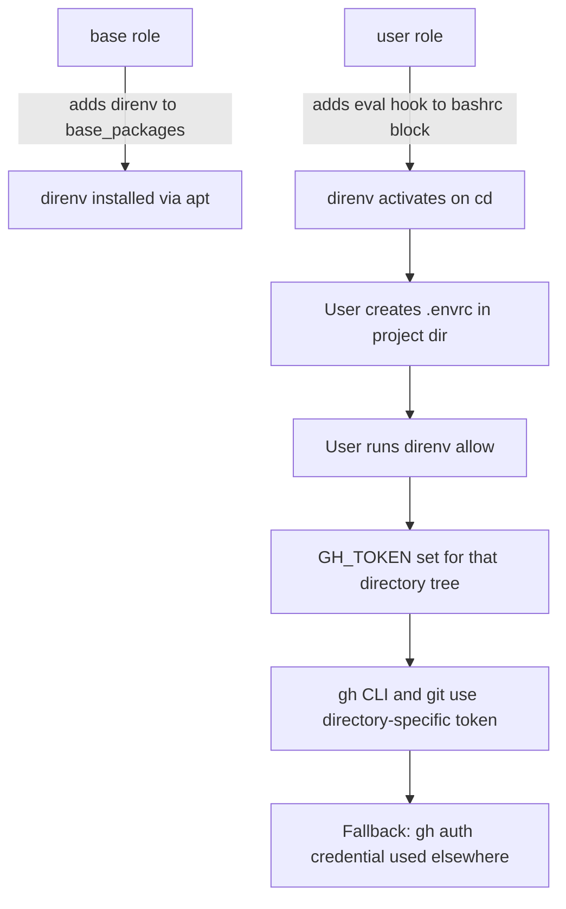

# Plan: Add direnv Support and GitHub Token Documentation

## Original Work Order

> Add direnv to this playbook. Update the README to explain how to use it to set separate GH_TOKEN environment variables for different directories. Also update the README to recommend creating fine-grained GitHub tokens with limited permissions for use within this system.

## Executive Summary

This plan adds `direnv` to the Ansible playbook so it is installed and hooked into bash on provisioned VMs. The playbook already supports per-directory git email configuration via `includeIf`; direnv extends this pattern to environment variables — specifically `GH_TOKEN` — enabling different GitHub tokens per project directory.

The existing `gh auth login` flow (driven by the `user_github_pat` variable) remains as the default credential. When `GH_TOKEN` is set in the environment — such as by direnv loading a `.envrc` file — the `gh` CLI and git credential helper use it instead, transparently overriding the default on a per-directory basis.

The README will be updated with two new sections: one explaining the direnv + `GH_TOKEN` workflow and another recommending fine-grained GitHub PATs with minimal permissions. This aligns with the security model of disposable, single-purpose VMs by limiting blast radius if a token is compromised.

## Context

### Current State vs Target State

| Current State | Target State | Why? |
|---|---|---|
| direnv is not installed | direnv is installed via apt and hooked into bashrc | Enables per-directory environment variable management |
| Single PAT via `gh auth login` for all directories | Per-directory `GH_TOKEN` via `.envrc` files (with `gh auth` as fallback) | Different projects may need different tokens with different scopes |
| README has no guidance on token scoping | README recommends fine-grained PATs with minimal permissions | Reduces blast radius of compromised tokens; security best practice |
| README has no direnv documentation | README explains direnv + `GH_TOKEN` workflow | Users need to know how to use the newly installed tool |

### Background

The `gh` CLI and `git` credential helper already use `GH_TOKEN` when it's set in the environment, taking precedence over the stored `gh auth` credential. This means direnv can transparently override GitHub authentication per directory without any changes to git or gh configuration.

direnv is available in the Debian 13 (trixie) apt repositories, consistent with how other tools in this playbook are installed.

direnv has a built-in security model: `.envrc` files must be explicitly approved via `direnv allow` before they are loaded. This prevents arbitrary environment variable injection from untrusted directories (e.g., after cloning a repo containing a malicious `.envrc`).

## Architectural Approach

### direnv Installation

**Objective**: Install direnv and activate its bash hook so it works automatically on login.

Add `direnv` to the `base_packages` list in `roles/base/defaults/main.yml`. This is where all apt-installable tools are declared, and direnv fits naturally alongside existing CLI utilities.

Add `eval "$(direnv hook bash)"` to the managed bashrc block in `roles/user/tasks/main.yml`. This must be the **last line** in the block since direnv's hook wraps the prompt command (`PROMPT_COMMAND`). Placing it before other exports is fine functionally, but convention and the direnv docs recommend it at the end.

### README Documentation

**Objective**: Document how to use direnv for per-directory `GH_TOKEN` and recommend fine-grained token creation.

Add new subsections under the existing **"GitHub Authentication"** heading in `README.md`, after the current "Changing the token after deployment" subsection:

1. **Per-directory GitHub tokens with direnv** — Explain that direnv is installed on the VM and activated in bashrc. Show how to create a `.envrc` file with `export GH_TOKEN=github_pat_xxx`, run `direnv allow`, and how this overrides the default `gh auth` credential for that directory tree. Include a concrete example with two project directories using different tokens. Note that `direnv allow` must be run after creating or modifying an `.envrc` (this is a security feature, not a bug). Recommend adding `.envrc` to `.gitignore` to prevent accidental token commits.

2. **Recommended: Fine-grained Personal Access Tokens** — Explain why fine-grained PATs are preferred over classic PATs: they can be limited to specific repositories, grant only specific permissions, and have mandatory expiration dates. Recommend creating separate tokens per project or client with only the permissions needed (e.g., `Contents: Read and write` for code push, `Pull requests: Read and write` for PR creation). Reference the GitHub fine-grained token settings page path (`Settings > Developer settings > Personal access tokens > Fine-grained tokens`).

## Risk Considerations and Mitigation Strategies

Technical Risks

- **direnv hook ordering in bashrc**: The direnv hook must be placed correctly relative to other bashrc content to function properly.
    - **Mitigation**: Place it as the last line in the managed block; the `blockinfile` module keeps everything in a single managed section, making ordering predictable.

Security Risks

- **`.envrc` files containing tokens in plaintext**: Tokens stored in `.envrc` files are readable on disk.
    - **Mitigation**: The VM is designed as disposable and single-purpose, limiting exposure. Document that `.envrc` should be added to `.gitignore` in project repos to prevent accidental commits.

- **Malicious `.envrc` in cloned repositories**: A cloned repo could contain a `.envrc` that sets unexpected environment variables.
    - **Mitigation**: direnv's `allow` mechanism prevents this — `.envrc` files must be explicitly approved before they are loaded. This is built-in behavior, no configuration needed.

## Success Criteria

### Primary Success Criteria
1. A freshly provisioned VM has `direnv` installed and the bash hook active — `cd`ing into a directory with an allowed `.envrc` triggers automatic loading
2. README clearly explains how to create `.envrc` files with `GH_TOKEN` for per-directory GitHub authentication
3. README includes a recommendation section for fine-grained PATs with guidance on minimal scoping

## Documentation

- **README.md**: Add subsections under "GitHub Authentication" for direnv usage with `GH_TOKEN` and fine-grained PAT recommendations

## Resource Requirements

### Development Skills
- Ansible playbook authoring (apt packages, blockinfile)
- Markdown documentation writing

### Technical Infrastructure
- Debian 13 apt repository (direnv package)
- No external dependencies beyond what's already in the playbook

## Integration Strategy

The existing `user_github_pat` / `gh auth login` provisioning flow is unchanged. It continues to serve as the VM-wide default GitHub credential. direnv adds a layer on top: when a user `cd`s into a directory with an `.envrc` that exports `GH_TOKEN`, that token takes precedence for all `gh` and `git` operations in that directory tree. When they leave the directory, direnv unloads the variable and the default `gh auth` credential resumes.

This coexistence requires no code changes to the existing roles — just the addition of the direnv package and bash hook.

## Notes

### Change Log
- 2026-03-09: Initial plan created
- 2026-03-09: Refined — clarified gh auth/GH_TOKEN coexistence, added direnv allow security model details, specified README section placement, added malicious .envrc risk, added Integration Strategy section
